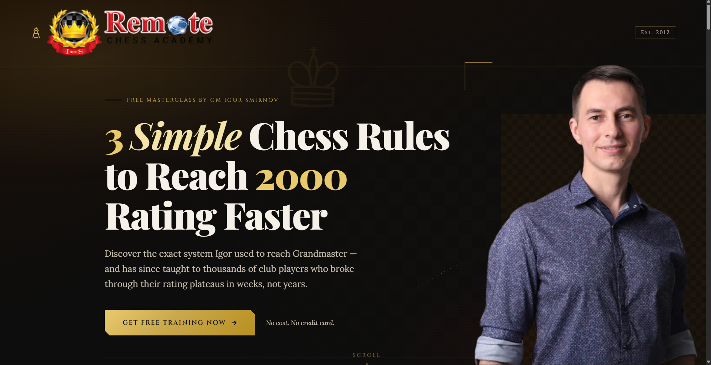

# Online Chess Learning Website — Landing Page

A conversion-focused landing page redesign for **GM Igor Smirnov's Remote Chess Academy** free masterclass. Built from scratch in vanilla HTML, CSS, and JavaScript — vibrant yet tasteful, with a premium feel that reflects the strategy and intellect of chess.


<!-- Replace img/screenshot.png with your own screenshot — see "Adding a screenshot" below. -->

## ✨ Features

- **Premium design system** — deep obsidian background, ivory text, gold/amber accents, and a chessboard-textured hero
- **Typography** — Playfair Display for headlines, Lora for body copy, Cinzel for small-caps labels
- **Scroll-reveal animations** powered by `IntersectionObserver`, with every animation respecting `prefers-reduced-motion`
- **Conversion-optimized CTAs** — layered gold glow, hover shimmer sweep, and a one-time attention pulse on the hero CTA
- **Scannable benefit cards** — "What You'll Master" section uses bold lead-ins + bullet points instead of dense paragraphs
- **Live social-proof toast** — a bottom-left notification cycling through recent enrollments, with a pulsing live indicator, sound toggle, and dismiss control. Its first appearance is tied to real engagement (scrolling past the hero or pausing on the benefits section), not a flat timer
- **Email capture popup** for the free masterclass opt-in
- Fully **responsive, mobile-first** layout

## 🛠 Tech Stack

- HTML5, CSS3, vanilla JavaScript — no frameworks, no build step
- Google Fonts (Playfair Display, Lora, Cinzel)

## 📁 Project Structure

.
├── siterev.html # Page markup
├── siterev.css # All styling
├── siterev.js # Scroll reveal, popup, social-proof toast logic
├── img/ # Logo, portrait, chess piece assets
└── mixkit-long-pop-2358.wav # Toast notification sound


## 🚀 Getting Started

1. Clone the repo:
```bash
   git clone https://github.com/geraldgichimu65-sudo/Online-Chess-Learning-Website-Landing-Page-.git
```
2. Open `siterev.html` directly in a browser, or serve it locally:
```bash
   npx serve .
```
No build tools or dependencies required.

## 📋 Page Sections

1. **Hero** — headline, free masterclass CTA, trust signals, GM Igor Smirnov portrait
2. **What You'll Master** — four benefit cards covering openings, middlegame, mindset, and the RCA progression system
3. **Second CTA band** — a mid-page reinforcement of the free training offer
4. **About Igor** — background and credentials
5. **Achievements** — tournament wins and titled milestones
6. **Social Proof** — testimonials plus the live enrollment toast
7. **Final CTA** — closing invitation to the masterclass
8. **Email capture popup** — triggered from any primary CTA

## 🖼 Adding a Screenshot

To show the page in action:

1. Open `siterev.html` in your browser and take a screenshot (full-page screenshot extensions work well for capturing the whole hero + sections).
2. Save it into the `img/` folder, e.g. `img/screenshot.png`.
3. Commit and push:
```bash
   git add img/screenshot.png
   git commit -m "Add landing page screenshot"
   git push
```
The `` line at the top of this README will then render it automatically — no further changes needed.

## 📄 License

This project is for portfolio/client use. All chess content, branding, and imagery belong to Remote Chess Academy / GM Igor Smirnov.
